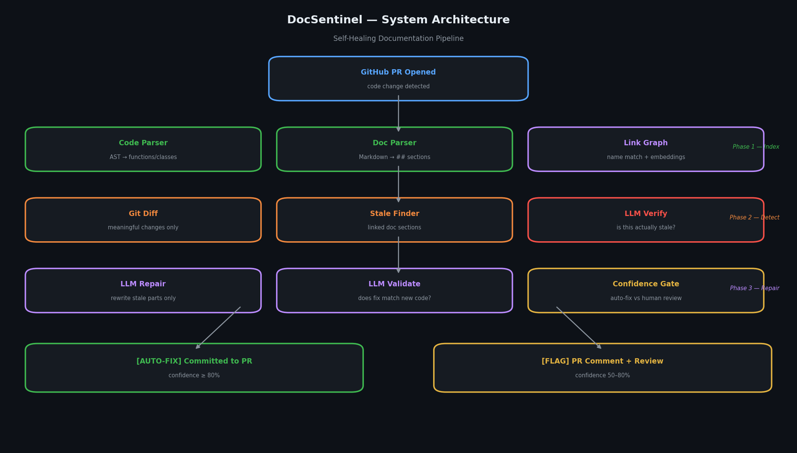
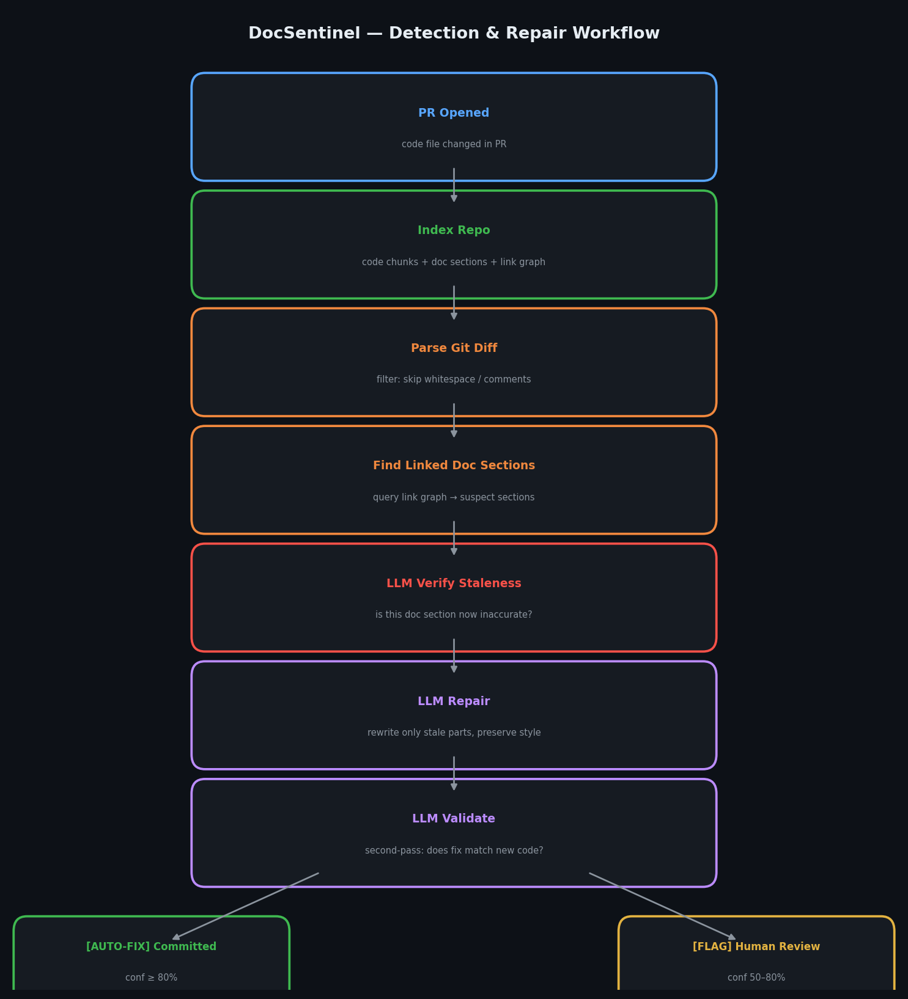
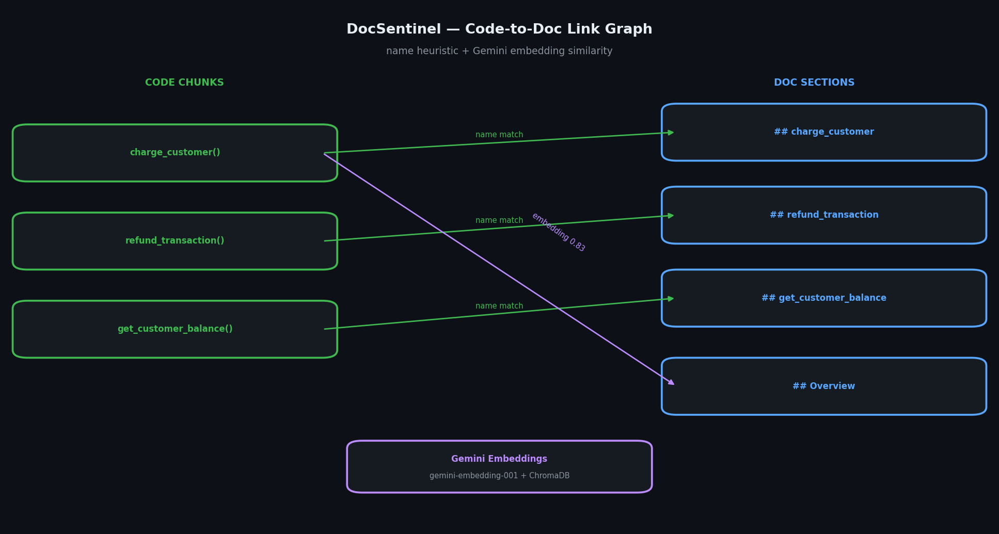

# DocSentinel

## Self-Healing Documentation for Engineering Teams

A GitHub Action that watches your code changes, finds stale documentation, and fixes it automatically — or flags it for human review.

Built for architects and developers who work with GitHub PRs and stored procedures daily.


---

## System Architecture



---

## The Problem

Every team's documentation goes stale. A stored procedure parameter gets renamed. A function signature changes. A return field is added. The README still describes the old behaviour. Nobody notices until someone wastes an hour debugging against wrong docs.

DocSentinel catches this automatically inside your CI/CD pipeline — on every PR, before the change merges.

---

## How It Works



Three phases run automatically on every PR that modifies code:

**Phase 1 — Index**
- Python AST parser extracts functions, classes, and signatures
- Markdown parser splits documentation by `##` headings
- Link graph connects code chunks to doc sections via name matching and embedding similarity

**Phase 2 — Detect**
- Git diff parsed against the base branch
- Meaningful changes filtered (skips whitespace, comments, test files)
- Linked doc sections identified from the graph
- LLM verifies: is this section actually stale given the code change?

**Phase 3 — Repair**
- LLM rewrites only the stale parts, preserving original style and structure
- Second LLM pass validates the fix is accurate
- Confidence gate: auto-fix above 80%, flag for human review at 50–80%

---

## Code-to-Doc Link Graph



DocSentinel links code chunks to documentation sections using two methods:

- **Name heuristic** — if a doc section mentions a function or class name, they are linked instantly
- **Embedding similarity** — Gemini `gemini-embedding-001` embeddings stored in ChromaDB surface semantic connections that name matching misses

---

## Quick Start

### Prerequisites

- Python 3.11+
- Git
- Google Gemini API key
- GitHub repository with markdown documentation

### Setup

```bash
# Clone the repo
git clone https://github.com/your-username/docsentinel.git
cd docsentinel

# Create virtual environment
python -m venv venv

# Activate — Windows
venv\Scripts\activate

# Activate — macOS/Linux
source venv/bin/activate

# Install dependencies
pip install -r requirements.txt

# Configure environment
cp .env.example .env
# Add your GEMINI_API_KEY to .env
```

### Run the Streamlit Demo

```bash
streamlit run app.py
```

### Run the Indexer

```bash
python engine.py ./demo_repo
```

---

## GitHub Action Setup

Add one secret to your repository:

```
GEMINI_API_KEY = your_key_here
```

The workflow file `.github/workflows/docsentinel.yml` triggers automatically on every PR that modifies `.py` or `.sql` files.

**What happens on each PR:**
1. Repo is indexed — code chunks and doc sections linked
2. Git diff parsed — meaningful changes identified
3. LLM verifies staleness — false positives filtered
4. Repairs generated and validated
5. High confidence → fix committed to PR branch
6. Low confidence → comment posted on PR with flagged sections and suggested fix

---

## Streamlit Demo Modes

| Mode | What It Shows |
|---|---|
| Explorer | Code-to-doc link graph, chunk count, link methods |
| Detect Stale Docs | Run staleness detection from git diff, see reasons and confidence |
| Repair Engine | Side-by-side original vs repaired, confidence scores, auto-fix status |

---

## Demo Scenario

The `demo_repo/` folder contains a realistic payments API:

```
demo_repo/
├── payments_api/
│   └── processor.py     ← charge_customer, refund_transaction, get_customer_balance
└── docs/
    └── README.md        ← matching documentation
```

**To trigger a stale doc detection:**

```bash
cd demo_repo
git init && git add . && git commit -m "baseline"

# Edit processor.py — rename a parameter or add a return field
git add . && git commit -m "update charge_customer signature"
cd ..

streamlit run app.py
# Go to Detect Stale Docs → click Detect
```

---

## Architecture Decisions

| Decision | Choice | Reason |
|---|---|---|
| Embeddings | `gemini-embedding-001` | Free tier, high quality, no external dependency |
| LLM | Gemini 2.0 Flash | Fast, free tier, strong code reasoning |
| Vector store | ChromaDB file-based | No server, persists to disk, reuses across runs |
| Code parser | Python `ast` | Zero hallucination — actual AST, not regex guessing |
| Doc parser | Regex on `##` headings | Matches real GitHub markdown structure |
| Link graph | Name match + embedding | Name match catches obvious links; embedding catches semantic ones |
| Repair mode | Two-pass LLM | First pass repairs, second pass validates — reduces false fixes |

---

## Tech Stack

| Component | Tool |
|---|---|
| Language | Python 3.11+ |
| Code parsing | Python `ast` |
| Doc parsing | Regex — markdown headings |
| Embeddings | Gemini `gemini-embedding-001` |
| Vector store | ChromaDB |
| LLM (verify + repair) | Gemini 2.0 Flash |
| Git integration | `subprocess` + PyGithub |
| CI/CD | GitHub Actions |
| Demo UI | Streamlit |

---

## Project Structure

```
docsentinel/
├── engine.py                        # Core: indexer + detector + repair engine
├── app.py                           # Streamlit demo UI (3 modes)
├── config.py                        # Keys, thresholds, paths
├── docsentinel_action.py            # GitHub Action runner
├── requirements.txt
├── .env.example
├── .github/
│   └── workflows/
│       └── docsentinel.yml          # GitHub Action trigger
├── demo_repo/
│   ├── payments_api/
│   │   └── processor.py             # Demo: 3 payment functions
│   └── docs/
│       └── README.md                # Demo: matching documentation
└── images/
    ├── docsentinel_architecture.png
    ├── detection_repair_workflow.png
    └── code_doc_link_graph.png
```

Generated local files — ignored by Git:

```
chroma_store/
code_doc_map.json
__pycache__/
.env
```

---

## Business Impact

| Metric | Value |
|---|---|
| Documentation drift | Detected per PR, not per quarter |
| Auto-fix threshold | 80% confidence (configurable) |
| Human review threshold | 50–80% confidence |
| False positive filter | LLM verify pass before repair |
| Time to detect stale doc | Seconds, not hours |
| Target audience | Any team using GitHub PRs + markdown docs |

---

## Security Notes

- Never commit `.env`
- Use `.env.example` for placeholders only
- Rotate API keys if ever committed to git history
- Add RBAC before targeting docs with sensitive architecture decisions

---

## Known Limitations

- Targets Python files and markdown docs (`.py`, `.sql`, `.md`)
- Link graph quality depends on doc sections using `##` headings
- Auto-fix rewrites to disk — review before merging in production
- Gemini free tier rate limits apply for large codebases

---

## Built With

- Gemini 2.0 Flash + gemini-embedding-001 (free tier)
- ChromaDB
- GitHub Actions
- Streamlit
- PyGithub
- Python ast
